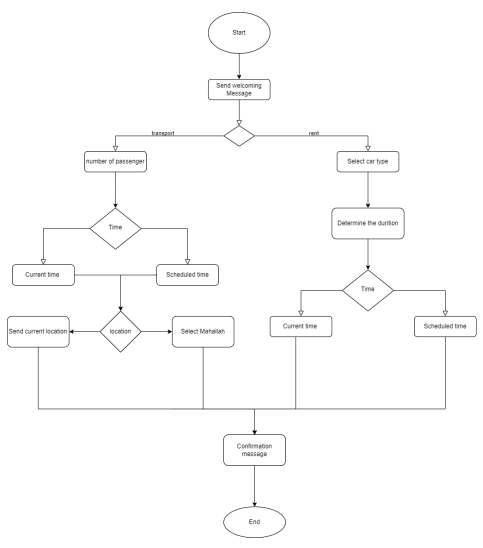
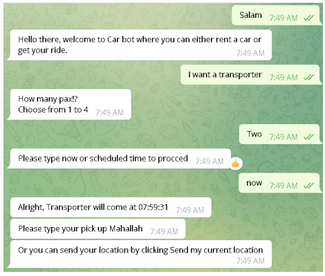
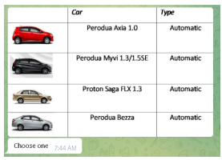
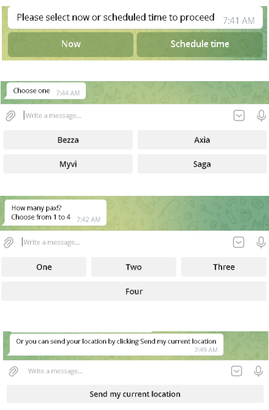
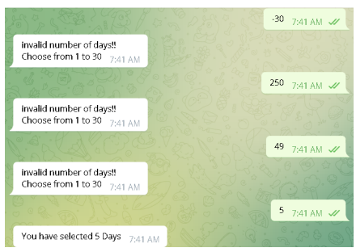
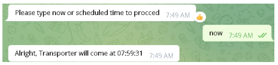

# IIUMCarBot
A chatbot, at its most basic level, is a computer software that replicates and processes human dialogue (written or spoken), allowing humans to communicate with digital devices as if they were speaking with a real person.

**Flow Chart**

**1-Can book a car or get a ride with normal conversation**

**2- Have the list of the available cars**

**3- Inline keyboard and option system to make it more efficient**

**4- Constraints on the selection of days when user can not exceed 30 days for more validity**

**5- Calculate the time for the ride**

